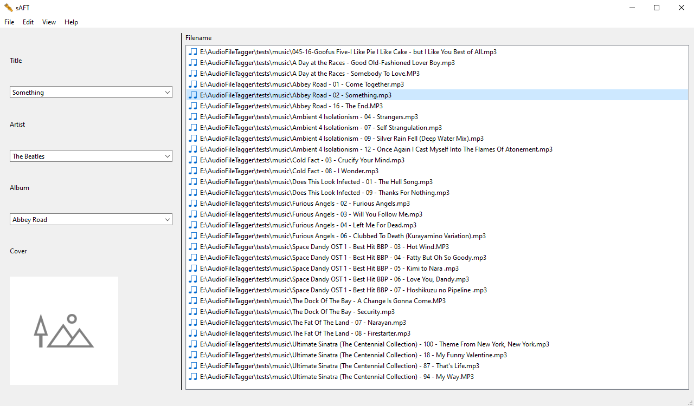

***

<h1 align="center">
    <sub>
        
    </sub>
    sAFT
</h1>

***

**DISCLAIMER: EARLY WORK IN PROGRESS.**<br />
sAFT is a GUI program that allows the user to edit and modify tags embedded in audio files (e.g. mp3, flac).<br />
Users may edit an audio file's Title, Artist and Album tags. Users may also embed images (e.g. album covers) in the audio files.

***

<p align="center">
    
</p>

***

* [Feature overview](#feature-overview)
* [Usage](#usage)
* [Installation](#installation)
* [Credits](#credits)

***

## Feature overview
sAFT's GUI is created entirely using PyQt.<br />
sAFT uses the mutagen Python module to read and modify Title, Artist and Album audio tags<br />
and embedded images contained in FLAC VorbisComment and MP3 ID3 metadata containers.<br />
(As of right now, only MP3 files are supported)

## Usage
1. User selects a directory containing compatible audio files/selects the audio files themselves.
2. User selects an audio file from the now loaded list of audio files in the right panel.
3. User views and/or modifies audio file's tags and embedded album covers.

## Installation
1. Running from source
```
git clone https://github.com/ptakf/AudioFileTagger.git
cd AudioFileTagger/
pip install -r requirements.txt
cd src/
python main.py
```

## Credits
- [PyQt](https://www.riverbankcomputing.com/software/pyqt/)
- [mutagen](https://github.com/quodlibet/mutagen)